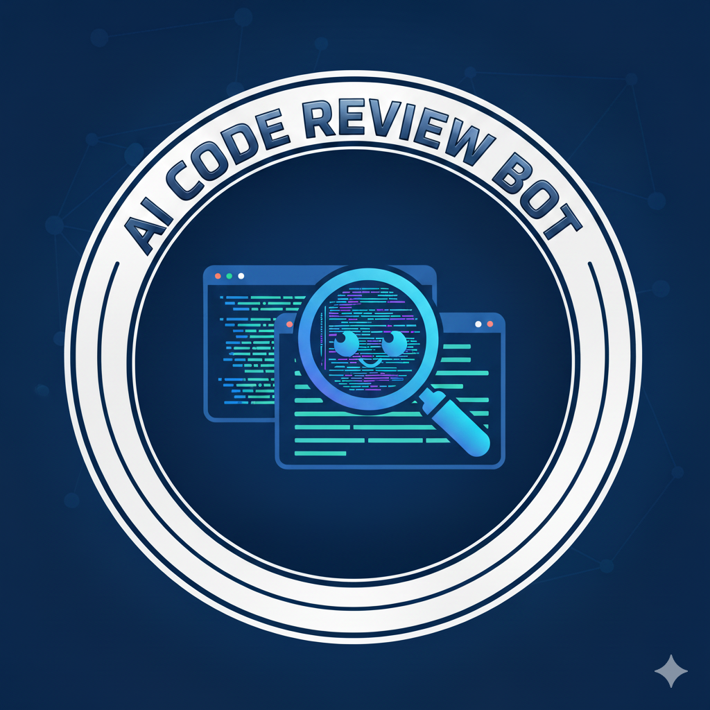

<p align="center">
  
</p>

# AI Code Review Bot

[](https://github.com/raffaelecarelle/ai-code-review-bot/actions/workflows/ci.yml)

Minimal, extensible AI-assisted code review tool for PHP projects.

- Analyzes unified diffs (from Pull/Merge Requests or files)
- Produces normalized findings (machine-readable JSON or human summary)
- Loads a simple YAML/JSON config with provider/policy settings and an optional coding guidelines file
- Safe defaults: deterministic Mock AI provider; no network calls unless configured

Official documentation: [Docs](https://raffaelecarelle.github.io/ai-code-review-bot/)

---

## Table of Contents
- 1. Objectives and scope
- 2. Architecture and main modules
- 3. Quick start
- 4. Configuration (.aicodereview.yml)
- 5. VCS adapters (GitHub/GitLab)
- 6. Coding guidelines file
- 7. AI providers and token budgeting
- 8. Output formats
- 9. Development and QA
- 10. Credits
- 11. License

---

## 1. Objectives and scope
- Functional
  - Analyze diffs and produce review findings for coding standard violations and simple risk patterns.
  - Dynamic configuration for providers, policy, token budget, rules, and VCS.
  - Post results back to PR/MR via platform adapters when requested.
- Non-functional
  - Safe defaults: no external calls by default (mock provider) and no PR comments unless `--comment`.
  - Modular design to plug real LLM providers and VCS platforms.

## 2. Architecture and main modules (PHP)
- `bin/aicr`: CLI entry point (Symfony Console) running the review command in single-command mode.
- `src/Command/ReviewCommand.php`: Orchestrates reading config, loading diff (from file or git), running Pipeline, and optional PR/MR commenting. Uses Symfony Process for git.
- `src/Config.php`: Loads YAML/JSON config, merges with defaults, expands `${ENV}` variables, exposes sections (providers, context, policy, vcs, prompts).
- `src/DiffParser.php`: Minimal unified diff parser returning added lines per file with accurate line numbers.
- `src/Pipeline.php`: End-to-end pipeline: parse diff, build AI provider, chunk with token budget, apply policy, and render output.
- `src/Adapters/`: VcsAdapter interface and GithubAdapter/GitlabAdapter implementations (resolve branches from PR/MR id and post comments).
- `src/Providers/`: AIProvider interface and concrete providers (OpenAI, Gemini, Anthropic, Ollama, Mock).

## 3. Quick start
- Install dependencies via Composer:

```bash
composer install
```

- Option A: Analyze an existing diff file
  - Create or use a unified diff, e.g., `examples/sample.diff`.
  - Run:

```bash
php bin/aicr review --diff-file examples/sample.diff --output summary
php bin/aicr review --diff-file examples/sample.diff --output json
```

- Option B: Analyze a PR/MR by ID using git
  - Configure `vcs.platform` in `.aicodereview.yml` (github or gitlab) and set required identifiers/tokens.
  - Then run (the command fetches branches, computes diff, and analyzes it):

```bash
php bin/aicr review --id 123 --output summary
```

  - To also post a comment back to the PR/MR, add `--comment`:

```bash
php bin/aicr review --id 123 --output summary --comment
```

Notes
- Provide `--config <path>` to use a non-default config file.
- Without `--diff-file`, `--id` is required and branches are resolved via the configured adapter.

## 4. Configuration (.aicodereview.yml)
Example (see `.aicodereview.yml` in this repo and `examples/config.*.yml`):

```yaml
version: 1
providers:
  # Safe deterministic provider by default
  default: mock
context:
  diff_token_limit: 8000
  overflow_strategy: trim
  per_file_token_cap: 2000
policy:
  min_severity_to_comment: info
  max_comments: 50
  allow_suggested_fixes: true
  redact_secrets: true
guidelines_file: null
vcs:
  # Set one of: github | gitlab | bitbucket
  platform: null
  # GitHub: owner/repo (optional if GH_REPO env or remote origin is GitHub)
  repo: null
  # GitLab: numeric id or full path namespace/repo (optional if GL_PROJECT_ID or remote origin is GitLab)
  project_id: null
  # GitLab: override API base for self-hosted instances (e.g., https://gitlab.example.com/api/v4)
  api_base: null
  # Bitbucket: workspace name (required for Bitbucket)
  workspace: null
  # Bitbucket: repository name (required for Bitbucket)
  repository: null
  # Bitbucket: access token for authentication (required for Bitbucket)
  accessToken: null
  # Bitbucket: API request timeout in seconds (optional, defaults to 30)
  timeout: 30
prompts:
  # Optional: append additional instructions to the base prompts used by the LLM
  # You can use single strings or lists of strings
  system_append: "Prefer concise findings and avoid duplicates."
  user_append:
    - "Prioritize security and performance related issues."
  extra:
    - "If a secret or key is detected, suggest redaction."
excludes:
  # Array of paths to exclude from code review
  # Each element is treated as glob, regex, or relative path from project root
  # Examples:
  - "*.md"           # Exclude all markdown files (glob)
  - "composer.lock"  # Exclude specific files (exact match)
  - "tests/*.php"    # Exclude files in specific directories with patterns (glob)
  - "vendor"         # Exclude entire vendor directory (directory)
  - "node_modules"   # Exclude node_modules directory (directory)
  - "build"          # Exclude build artifacts (directory)
  - "dist"           # Exclude distribution files (directory)
```

Notes
- Env var expansion works in any string value: `${VAR_NAME}`.
- Tokens/ids read from env if not set: `GH_TOKEN`/`GITHUB_TOKEN`, `GL_TOKEN`/`GITLAB_TOKEN`, `GH_REPO`, `GL_PROJECT_ID`.

## 5. VCS adapters (GitHub/GitLab/Bitbucket)
- Configure `vcs.platform` and required parameters as needed.
- The review command supports a single `--id` option (PR number for GitHub, MR IID for GitLab, PR ID for Bitbucket).
- Behavior when `--diff-file` is omitted:
  1) Resolve base/head branches from the ID via platform API.
  2) `git fetch --all`; fetch base/head; compute `git diff base...head`.
  3) Run the analysis pipeline on that diff.
- `--comment` posts the summary back via the adapter.

## 6. Coding guidelines file
- You can provide a project coding standard or style guide via `guidelines_file` in `.aicodereview.yml`.
- When set, its content is embedded into the LLM prompts as a base64 string. The prompt explicitly instructs the model to base64-decode the guidelines and follow them strictly during the review.
- No provider-specific file uploads are performed: all supported providers (OpenAI, Gemini, Anthropic, Ollama) receive the same base64-embedded guidelines in the prompt.

## 7. AI providers and token budgeting
- Supported providers in this repository: `openai`, `gemini`, `anthropic`, `ollama`, `mock`.
- Select via `providers.default` and configure each provider section accordingly (see `src/Providers/*` for options).
- Token budgeting is approximate (chars/4). Global and per-file caps are configurable; `overflow_strategy` defaults to `trim`.

## 8. Output formats
- `json` (default): machine-readable findings array.
- `summary`: human-readable bulleted list. This is also the format used for PR/MR comments.
- `markdown`: structured markdown format with emojis, metadata, and organized findings by severity and file.

## 9. Development and QA
- Requires PHP and Composer.
- Run unit and E2E tests with PHPUnit:

```bash
./vendor/bin/phpunit
```

- Coding standards and static analysis:

```bash
composer analyse
```

- The codebase uses `declare(strict_types=1)` and Symfony components (Console, YAML, Filesystem, Process).

## 10. Credits
- Author: Raffaele Carelle
- Contributors: Thanks to everyone who reports issues or submits PRs.

## 11. License
This project is open-sourced under the MIT License. See the LICENSE file for details.
